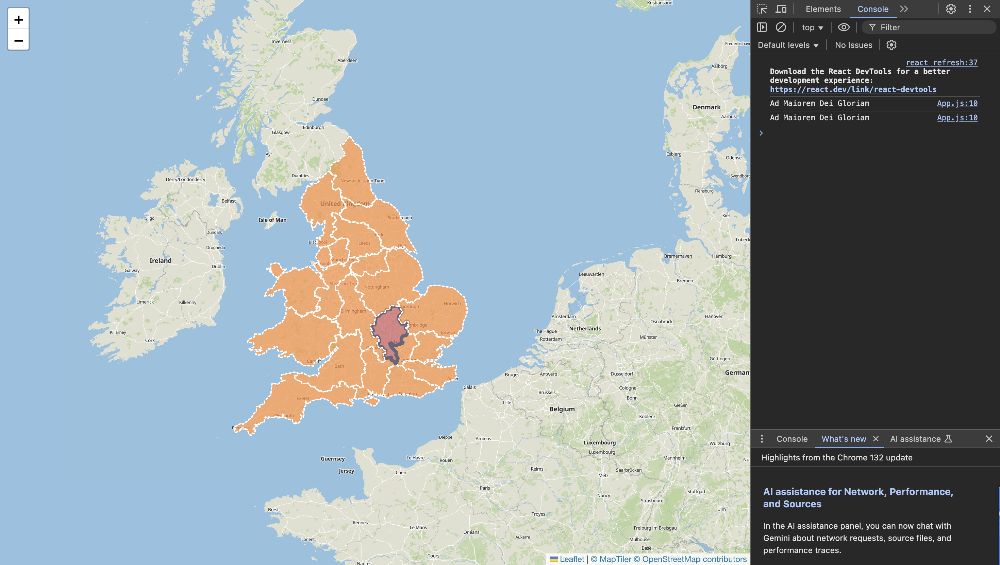

# Dioceses Map

An interactive map displaying the Catholic Dioceses of England & Wales.

As of 12th April 2025, it looks like this:

### Available Scripts

In the project directory, you can run:

`npm start`

Runs the app in the development mode.

Open http://localhost:3000 to view it in your browser.

The page will reload when you make changes.
You may also see any lint errors in the console.

### Still to do:

In no particular order:

- Start doing Test Driven Development
- Add the Isle of Man to Liverpool Diocese
- Add the Channel islands to Portsmouth Diocese
- Make the diocese borders more accurate so users can zoom in even further
- Label the Dioceses
- Add an info box
- Colour code by ecclesiastical province
- Start adding statistics and the ability to rank by statistics (e.g. population, number of baptisms, annual spending)
- Tidy up copyright notice
- Make a gif/timeline of how the diocese boundaries have changed over time
- Add in Cathedrals
- Add in Scottish and Irish dioceses
- (Stretch goal) Add in Anglican Dioceses + other religious regions

### Inspirations

Inspriation continues to be drawn from:

- [Catholic Dioceses of the USA Map](https://gavinr.com/catholic-dioceses-of-the-usa-map-updated/)
- [US Diocese Mapper](https://github.com/kburchfiel/us_diocese_mapper)
- [UKHSA Dashboard](https://ukhsa-dashboard.data.gov.uk/?type=cold)

### Tools & Resources

Tools:

- QGIS
- [Create Maps in Leaflet using ReactJS (Tutorial)](https://www.youtube.com/watch?v=2KUYOdTXK74)

Resources:

- [Catholic Dioceses of Great Britain (Wikipedia)](https://en.wikipedia.org/wiki/List_of_Catholic_dioceses_in_Great_Britain)
